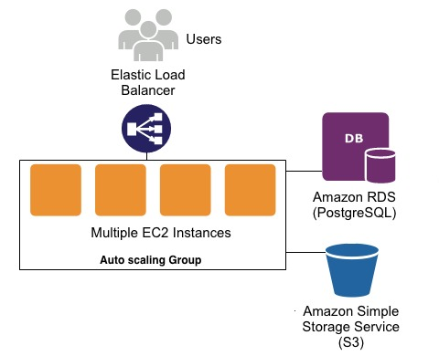

## Udagram Infrastructure


### Elastic Beanstalk
AWS Elastic Beanstalk is an easy-to-use service for deploying and scaling web applications and services in where we deploy our server.
EB URL: ```udagramelshopakyapi-env.eba-c2irwdmi.us-east-1.elasticbeanstalk.com```

### S3 Bucket
Amazon S3 is cloud object storage in where we deploy our static files (forntend).
S3 URL: ```elshopaky-udagram.s3-website-us-east-1.amazonaws.com```

### RDS PostgreSQL
Amazon Relational Database Service (RDS) in where we deploy our database for storing and retrieving information.
DB URL: ```database-1.cgjqwgeecgok.us-east-1.rds.amazonaws.com```