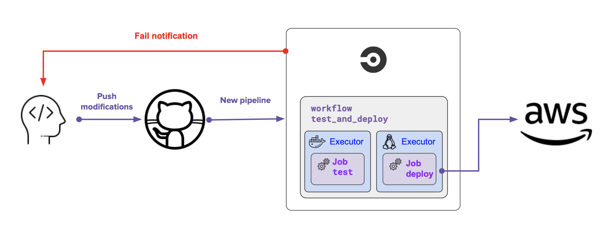

## Udagram Pipeline


There are 2 main jobs in the .circleci/config.yml to run, build and deploy the project, frontend and backend, CircleCI reads this file and starts the sequential workflow.

1. Build job:
    1. Setup the environment of the project: install node and checkout code, setup aws-cli, install dependencies in the frontend app and install dependencies in the the backend
        - Front-end Install: ```npm run frontend:install```
        - Back-end Install: ```npm run api:install```
    2. Build the frontend app
        - Front-end Build: ```npm run frontend:build```
    3. Build the backend API
        - Back-end Build: ```npm run api:build```
2. Depoly job:
    1. More setup needed for aws, node, elastic beanstalk in the docker image.
    2. Install, build, deploy in both apps.
        - Depoly the whole project: ```npm run deploy```
            - Front-end Deploy: ```npm run frontend:deploy```
            - Back-end Deploy: ```npm run api:deploy```
